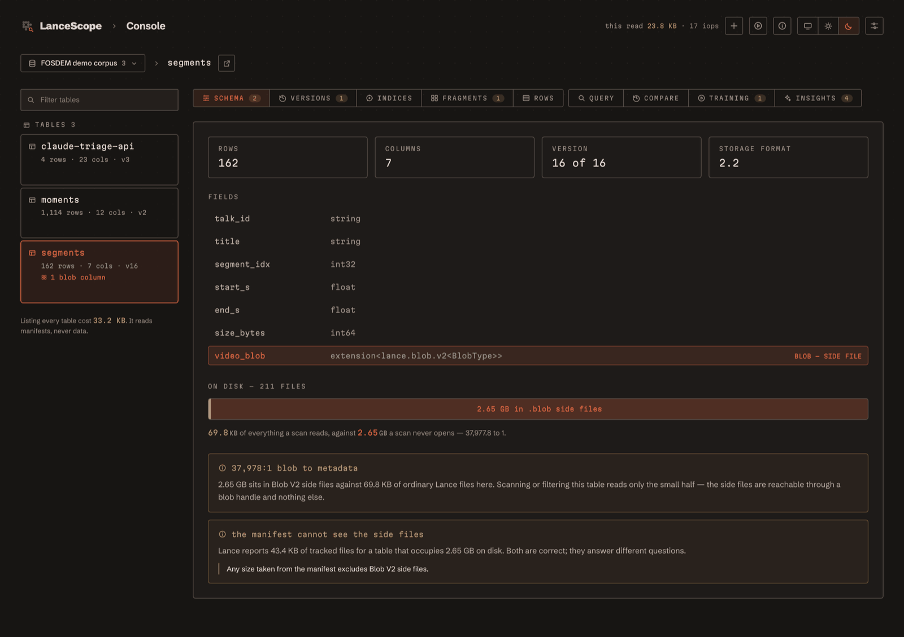
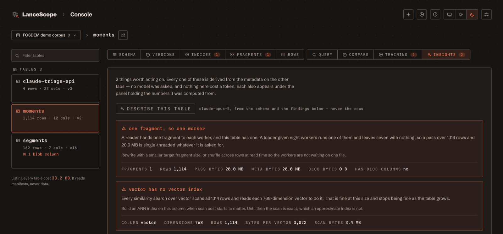
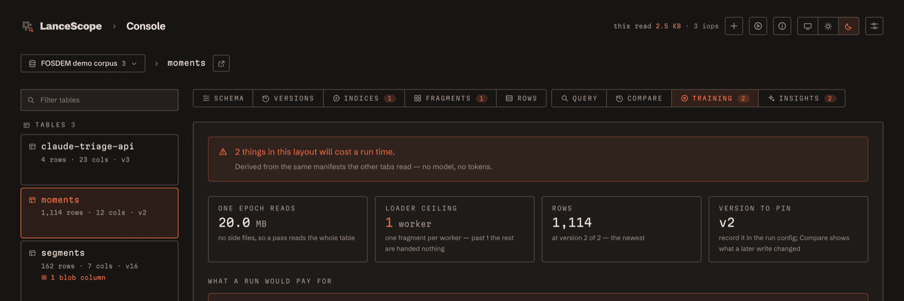
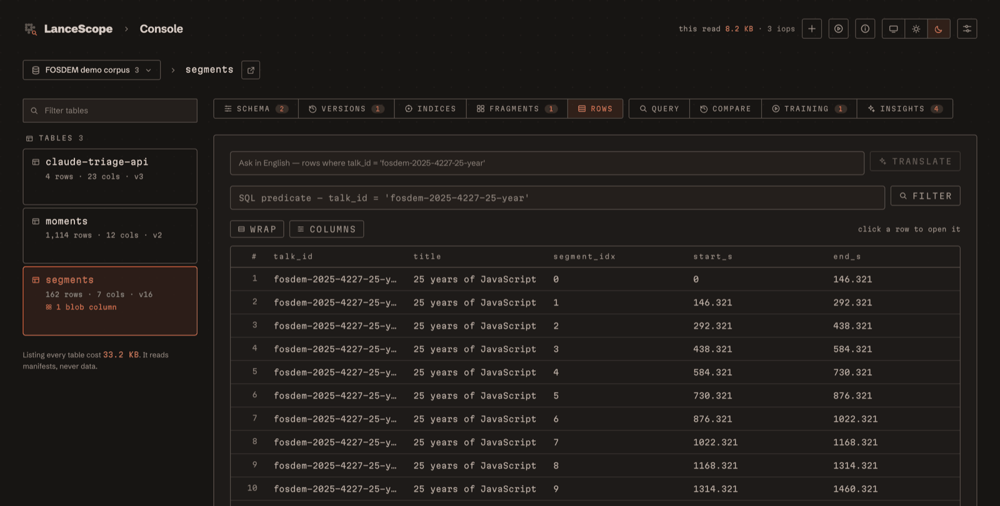
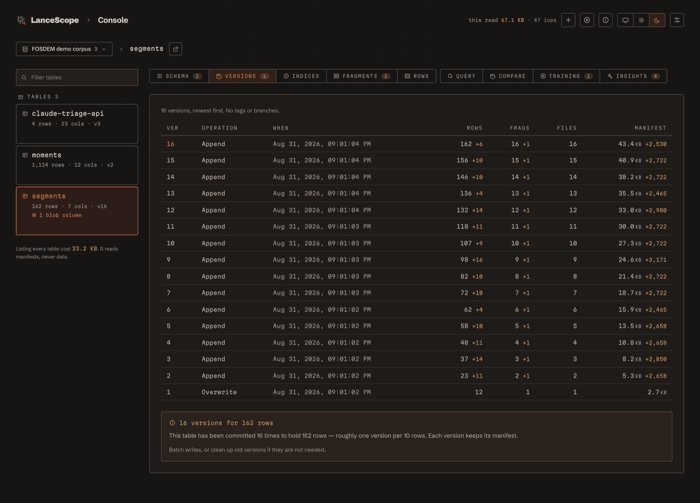
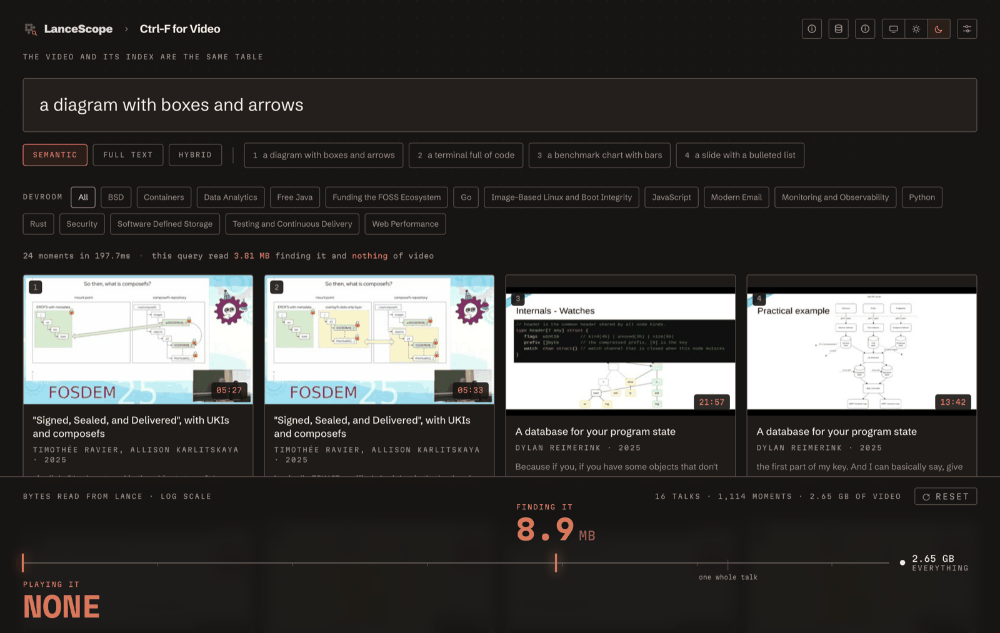

<div align="center">


# LanceScope

**A workbench for reading LanceDB datasets — schema, versions, indices, fragments and
rows, with the byte cost of every read shown as you go.**

*A Lance table can hold 2.65 GB of video while a search over it reads none of it.
The bytes a search touches and the bytes a table holds live in different files.
This measures both.*

[](https://github.com/mrlynn/lancescope/actions/workflows/ci.yml) [](https://github.com/mrlynn/lancescope/actions/workflows/images.yml) [](https://github.com/mrlynn/lancescope/actions/workflows/release.yml) [](https://github.com/mrlynn/lancescope/tags) [](LICENSE)

[](.python-version) [](docs/guide/reference-versions.md) [](docs/guide/explain-blobs.md) [](server/) [](web/) [](https://github.com/mrlynn/lancescope/pkgs/container/lancescope) [](docs/guide/reference-mcp.md) [](.github/workflows/ci.yml) [](docs/guide/howto-desktop.md)

**[Website](https://lancescope.mlynn.dev)** · **[Live console](https://demo.lancescope.mlynn.dev/console)** · **[Docs](https://lancescope.mlynn.dev/docs)** · **[Guide](docs/guide/index.md)** · **[Releases](https://github.com/mrlynn/lancescope/releases)**

</div>

<br>



<div align="center"><sub>Describing 2.65 GB of video costs 23.8 KB and reads none of it. Every panel says what it spent.</sub></div>

<br>

---

## What it does

Four things, precisely.

| | |
|---|---|
| **Reads a database, exactly** | Schema, versions, indices, fragments and rows, with the byte cost of each read shown as you go. Nothing here writes to a dataset. |
| **Answers "why is this slow"** | Run a scalar, full-text, vector or hybrid query; see which access path Lance chose, what it read, and the Python that reproduces it elsewhere. Compare two versions of a table and run the same query against both. |
| **Says what it already knows** | Ten rules over metadata — an unindexed vector column, small-file counts that would mislead, tombstone debt, a manifest that understates the size of the thing it describes — each carrying the numbers it was derived from. No model is involved in any of them. |
| **Adds language, optionally** | With a local model or an API key it translates a question into a filter and describes a table in a few sentences. Every response reports the tokens and dollars it spent beside the bytes it read. |

### Findings, derived rather than generated



Ten rules run over the same manifests the other tabs read. Each finding carries its
evidence on the same row — fragments, rows, pass bytes, bytes per vector — and each
also appears under the panel holding the numbers it came from. Nothing here costs a
token, because no model is asked.

### What a table's shape costs a training run



The same rules narrowed to what a training run actually pays for: how many bytes an
epoch reads, how many loader workers the fragment split can feed, and the version to
record in the run config. It reports the layout and nothing about the data — it
cannot tell you whether your labels are right, and says so.

### Rows, and a filter you can write in English



Heavy columns — vectors, images, and Blob V2 columns holding the large data — are
described from the schema rather than materialised. Browsing a table that holds
gigabytes of video costs kilobytes, and that is the point rather than a limitation.

### Every write a table has ever taken



---

## Quick start

Three ways in. All of them read your data where it already is.

### From source — about five minutes

```bash
git clone https://github.com/mrlynn/lancescope && cd lancescope
make setup
make dev
```

Then open `localhost:3000/console` and point it at any directory holding `.lance`
tables — or paste a Hugging Face URI and read someone else's over the network, without
downloading it. Needs [uv](https://docs.astral.sh/uv/) and Node 22.

`make local` is the other one worth knowing: it serves the exported interface and the
API on **one origin**, which is what actually ships. A static export has no rewrites
and no dev server, and that difference has broken things `make dev` could not see.

### In a container

The way in on Linux, on a server, or beside a pipeline already writing Lance tables:

```bash
docker run --rm -p 8088:8080 \
  -v /path/to/your/lance:/data:ro \
  ghcr.io/mrlynn/lancescope:pylance-11.0.0
```

There is **one image per Lance reader**, because a Lance reader is not universal: a
dataset written by one version may need that version to read it. The tag names the
reader, and [`docker/compose.yaml`](docker/compose.yaml) is the version worth having
when something else in the stack owns the volume.

### The macOS app

```bash
make app
```

Builds `LanceScope.app` — a window with its own title bar, running a server it starts
and stops itself. Nothing to install on the machine it lands on: no Python, no Node, no
Lance. 160 MB as a DMG.

It carries the console and leaves out torch, so the demo's semantic search is
unavailable in a packaged build and says so. `./desktop/sign.sh` signs and notarises it
with a Developer ID — see [the guide](docs/guide/howto-desktop.md). A signed, notarised
DMG is built by the tagged release workflow rather than by hand; until one is published,
building it yourself is the whole thing and nothing is missing from it.

### Or look at one first, in a browser

**[demo.lancescope.mlynn.dev](https://demo.lancescope.mlynn.dev/console)** — the console
itself, on a public LanceDB dataset, with nothing to install. Read-only, rate limited,
and pinned to one dataset it does not host: pylance opens `hf://` lazily, so the
deployment stores nothing and reads only what you look at.

---

## Pointing it at your own data

The console is not wired to the demo. It reads whatever connection is active, and you
manage those at **`/console/settings`** — paste a path, check what is there, switch. The
catalog is repointed in place; nothing restarts.

Where the root comes from, in order:

| rung | when |
|---|---|
| `LANCE_ROOT` | set in the environment — wins, and the settings page says so |
| the active connection | saved in `~/.config/lancescope/settings.json` |
| `data/lance` | first run with nothing configured, **and only if it holds tables** |
| nothing | the console says so and points at settings |

`LANCESCOPE_CONFIG` moves the settings file. Connections may be local directories,
`hf://datasets/…` roots, or `s3://` / `db://` URIs.

The **datasets LanceDB publishes** on Hugging Face open directly — the settings page
offers five of them, so a fresh install has something to look at without building
anything first:

```
hf://datasets/lance-format/openvid-lance/data
```

937,957 rows carrying the MP4s themselves beside their embeddings. Opening it costs
24,568 bytes; browsing five rows costs about 73 KB and reads no video at all. The same
claim this repo makes about its own corpus, checked against someone else's.

`s3://` and `db://` are still saved unverified rather than falsely ticked: discovery
there needs an adapter that does not exist yet, and the console says so instead of
showing an empty database.

---

## The write boundary

**It will build you a database. It will never edit one.**

- **Browsing.** Reading a table cannot change it. That is checked rather than asserted:
  a test drives the entire read API and every MCP tool over a real corpus and then
  checks that not one byte on disk moved.
- **Building.** The ingest wizard creates a new table from your own files — image,
  video, audio or PDF — and that is the only thing in the project that writes one. It
  is create-only by construction: it refuses a destination that already exists, only
  ever appends into a table it made during that same run, and has no reachable path to
  an overwrite.

The whole write surface is one module, and CI fails if a dataset mutation appears
anywhere else. Deleting only ever happens when you ask for it: the button that clears a
finished job and the button that deletes the table it produced are deliberately two
different buttons.

---

## Point an agent at it

The console's read surface is also an MCP server, so Claude Code — or any agent host
that speaks MCP — can inspect a LanceDB database directly:

```bash
claude mcp add lancescope -- uv --directory /path/to/lancescope run python -m server.mcp_server
```

**Which database?** Whichever connection the console is pointed at — the same ladder,
resolved on every call, so switching connections in the console switches what the agent
sees. `list_tables` reports the root it resolved, so the agent can say which database it
is describing. To pin it to one instead, independently of the console:

```bash
claude mcp add lancescope --env LANCE_ROOT=/path/to/tables -- \
  uv --directory /path/to/lancescope run python -m server.mcp_server
```

Seven tools — `list_tables`, `describe_table`, `read_rows`, `table_findings`,
`table_fragments`, `table_indices`, `table_versions` — every one of them read-only and
declared as such, and none able to materialise a blob column, because the routes
underneath them cannot. It needs no key of its own: the intelligence is the agent's, and
the tools are the same routes the console calls.

Ask it *"what's in this database and what's wrong with it"* and it comes back with the
unindexed vector column and what a search therefore costs — with the numbers those
conclusions were derived from, not a summary of them.

---

## Intelligence

Optional, and the console is useful without it. The settings page configures which
provider powers the language layer — Claude, a local Ollama model, or any
OpenAI-compatible endpoint — and reports what is actually available on the machine right
now, including the models Ollama has pulled.

```bash
ollama pull qwen3:8b            # local, free, offline, no account
export ANTHROPIC_API_KEY=sk-…   # or Claude, with the cost of every call shown
```

Neither is required, and neither has to be configured: with a key set the Claude path
comes up on its own, and with Ollama running the local one does. An explicit choice in
settings beats both. A key pasted into the settings page is stored at mode 0600 — the
environment variable is the safer path and always wins over it.

**Test it before trusting it.** *Test the model* spends one real call on the configured
provider and reports what came back, how long it took and what it cost, so a stale key or
a deleted model is a sentence on screen rather than a mystery three features later:

```
answered, and honoured the schema
gemma3:27b · 11.8s · 72 in / 41 out · no cost — this ran on your machine
```

`GET /intel/capabilities` is the same answer without spending anything. Both report
`cost_usd: null` rather than a guess for a model that isn't in the price registry —
prices are cached data, and carry the date they were read.

---

## Which Lance readers work

Measured rather than assumed. [`scripts/compat/probe.py`](scripts/compat/probe.py)
installs each candidate into its own environment and reads a real blob table with it,
and the floor it establishes is **pylance 3.0.0**:

| below the floor | what breaks |
|---|---|
| `2.0.1` | sees a Blob V2 column and cannot open it against storage format 2.2 |
| `1.0.4` | does not recognise a Blob V2 column at all |
| `0.38` | has no `io_stats_incremental`, so every byte figure in the console is missing |

That last one was this project's declared floor until the probe was written — a number
nobody had checked.

CI runs the contract tests against **eight readers on every push** — 3.0.0, 4.0.2,
6.0.1, 7.1.0, 8.0.1, 9.0.1, 10.0.0, 11.0.0 — and a row goes red if the reader is missing
a capability the console names, not merely if a test fails. The same eight are published
to `ghcr.io`, and the settings page has a **The reader** section naming the versions
underneath and anything they cannot do.
[Lance versions](docs/guide/reference-versions.md) is the matrix.

---

## The guide

Everything above in more depth, and served by the app itself at **`/docs`** — a tutorial,
how-to guides, generated reference, and the reasoning behind the decisions that look odd:

| | |
| --- | --- |
| [What LanceScope is](docs/guide/index.md) | the shape of the thing |
| [Getting started](docs/guide/start-here.md) | clone to a real finding, about five minutes |
| [Connect a database](docs/guide/howto-connect.md) | local, switching, pinning, remote |
| [Diagnose a slow query](docs/guide/howto-diagnose.md) | access paths, costs, before and after |
| [Enable the language layer](docs/guide/howto-intelligence.md) | local and free, or a key |
| [Point an agent at it](docs/guide/howto-agents.md) | MCP, and which database it reads |
| [Run it in a container](docs/guide/howto-container.md) | Docker and Compose, pinned to the reader your data needs |
| [Build a desktop app](docs/guide/howto-desktop.md) | the sidecar, signing, notarisation |
| [Reference](docs/guide/reference-configuration.md) | config, query modes, findings, models, tools, routes |
| [Lance versions](docs/guide/reference-versions.md) | which readers are supported, and how that was measured |
| [Why it works this way](docs/guide/explain-cost.md) | cost as the unit, Blob V2, evidence before advice |

The six reference pages are generated from the code by `make docs`, and `make test`
fails if they drift from it.

---

## Before you push

```bash
make check
```

Everything CI runs, in the order that fails cheapest first: `ruff` on the same pin the
workflow uses, the contract tests, then the interface's typecheck, lint and build. It
ends by building the container and booting it to ask which reader is inside, because a
container that starts is not a container that serves.

Docker Desktop is found where it actually installs itself rather than only on `PATH` —
its CLI lives in `~/.docker/bin`, which plenty of shells never see. Where there is
genuinely no Docker, or its daemon is not answering, the target says which of the two
and moves on, so a skipped check never reads as a passed one.

`make test` stays the fast inner loop and covers one of CI's five jobs; `make check`
covers four, and `tests/test_check.py` fails if a job is added to the workflow that the
target neither runs nor explicitly excuses. The fifth is the eight-version reader
matrix, which is minutes rather than seconds and is excused by name.

`make verify` is a different gate: the real corpus rather than synthetic fixtures, and
the one that has to pass before a demo.

---

## Ctrl-F for Video



A ~10 minute conference demo of LanceDB, built around one claim:

> **The video and its index are the same table.**

You type *"a diagram with boxes and arrows"*, get back actual frames from a corpus of
conference talks, click one, and the video plays at that exact second — while an
instrument along the bottom of the screen shows how few bytes moved to make it happen.

No OCR ran. Nobody captioned those frames. And searching the whole corpus reads **zero
bytes** of video — not "very little", zero, because the video bytes are not in the files
a search opens.

### Why this and not another RAG demo

The interesting part of LanceDB in 2026 isn't vector search — it's that a Lance table can
hold the MP4 *itself* in a Blob V2 column, in a side file, behind lazy handles. Search
and filter cannot touch it. That is hard to assemble out of S3 + Postgres + a vector DB,
and it makes for a claim you can prove live rather than assert on a slide.

### Measured numbers

Every figure comes from Lance's own IO accounting (`Dataset.io_stats_incremental()`), not
from anything measured off to the side. Run `make verify` to reproduce.

Measured on a 16-talk corpus: **1,114 moments, 162 segments, 2.65 GB of video.**

| operation | index bytes | video bytes |
|---|---|---|
| semantic search over every moment | 3.45 MB | **0** |
| full-text search over transcripts | 0.11 MB | **0** |
| the same search, filtered to one devroom | 3.45 MB | **0** |
| open a blob handle | — | 2,722 |
| start playback (cold segment) | — | ~17 MB, one segment |
| seek again inside it (warm) | — | 262,144 — byte-exact |

On disk that table is **2.65 GB of video in `.blob` side files against 20.1 MB of
everything a search reads** — a ratio of 132 to 1, which the `S` view shows live.

See [FINDINGS.md](FINDINGS.md) for the measurements that shaped the design, including the
one that forced videos to be stored as ~16 MB segments rather than whole files.

### Running it

```bash
make setup                # uv sync + npm install
make ingest LIMIT=36      # download, transcode, segment, embed, build, verify
make demo                 # API on :8000, UI on :3000
```

Once set up, **double-click `LanceScope.command`** in Finder instead — it runs the same
thing, checks the handful of conditions that otherwise fail silently, and opens the
console for you. Closing the window stops both servers.

Requires `ffmpeg` on PATH. Everything else lives in the venv. Once ingested the demo runs
**fully offline** — no network, no services, no containers. It needs a built corpus and a
local embedding model, so it is not in the packaged app: the DMG deliberately ships
without torch, and the demo screen says so rather than failing quietly.

### On stage

The interface is driven from the keyboard so you never hunt for a mouse:

| key | does |
|---|---|
| `1`–`4` | run the four rehearsed queries |
| `/` | focus the search box to type something the audience suggests |
| `↵` | open the first result |
| `S` | the schema, read live off disk — this is the Act 3 slide |
| `R` | reset the byte instrument |
| `T` | light / dark — dark is the default, and the right one for a projector |
| `Esc` | close whatever is open |

### The ten minutes

1. **The architecture isn't a triangle.** Every video search system is S3 + Postgres + a
   vector DB + a queue. Replace that slide with one box.
2. **Search.** `1` finds diagrams by what they look like. `2` and `3` show it holds up.
   Switch to full text, then hybrid. Then pick a devroom — the SQL predicate runs
   *inside* the vector search, not as a filter afterwards.
3. **The schema** (`S`). `video_blob` sits in the same table as the embeddings. The panel
   at the bottom is the point: gigabytes of video in `.blob` side files, and a few
   megabytes of everything a search actually reads.
4. **The instrument.** Press `R` to zero it. Run a search: the *playing it* needle stays
   pinned at NONE. Then open a result and watch it move. That's the close.
5. **The doors not walked through.** Branching and shallow clone, Geneva backfills,
   DuckDB SQL over the same files.

### The corpus

[`ingest/download.py`](ingest/download.py) builds it from the
[FOSDEM](https://video.fosdem.org) video archive: direct MP4s over plain HTTP, official
`.vtt` subtitles for every talk, and a schedule feed that supplies real titles, speakers
and devrooms. Talks are transcoded to 720p on the way in, which keeps slide text sharp at
about a third of the bytes.

FOSDEM recordings are published under CC-BY. The videos are gitignored regardless — the
repo ships the pipeline, not the corpus.

A YouTube path survives in `ingest/download_youtube.py`, but YouTube rate-limits scraping
hard and answers with bot checks. It is a bad thing to depend on the night before a talk,
which is why it is not the default.

---

## How it fits together

```
Next.js (:3000)  ──/api/*──>  FastAPI (:8000)  ──>  LanceDB on local disk, hf:// or s3://
                                    │                        │
                              SigLIP (MPS)            MCP server (stdio)
```

```
ingest/    download + transcode -> segment + keyframes -> SigLIP -> Lance tables
server/    FastAPI: catalog, query, findings, intelligence, ingest jobs, MCP
web/       Next.js: home, console, docs, settings, the demo
docker/    one image per Lance reader
desktop/   Tauri shell, PyInstaller sidecar, signing and notarisation
scripts/   blob_bench.py (the evidence), verify.py (green-room preflight), compat/probe.py
docs/      the guide, generated reference, sprint plans
```

Two tables in the demo corpus, one format, one store, zero services:

- **`moments`** — one row per keyframe: SigLIP embedding, transcript window, thumbnail,
  speaker, devroom. This is all a search ever touches.
- **`segments`** — one row per ~16 MB playable MP4 chunk in a Blob V2 column, streamed to
  the browser over HTTP Range straight out of the column.

The data layer is Python because `take_blobs` and multivector search are Python-only
today; the TypeScript SDK covers vector, FTS and hybrid but not blobs.

---

<div align="center">

Licensed under [Apache-2.0](LICENSE). See [CONTRIBUTING.md](CONTRIBUTING.md) for how the
work is planned and landed.

<sub>An independent tool. Not affiliated with, endorsed by, or supported by LanceDB. The
dot lattice in the mark is derived from theirs, with thanks; the glass is ours. LanceDB
and Lance, and their logos, are the property of their owner.</sub>

</div>
